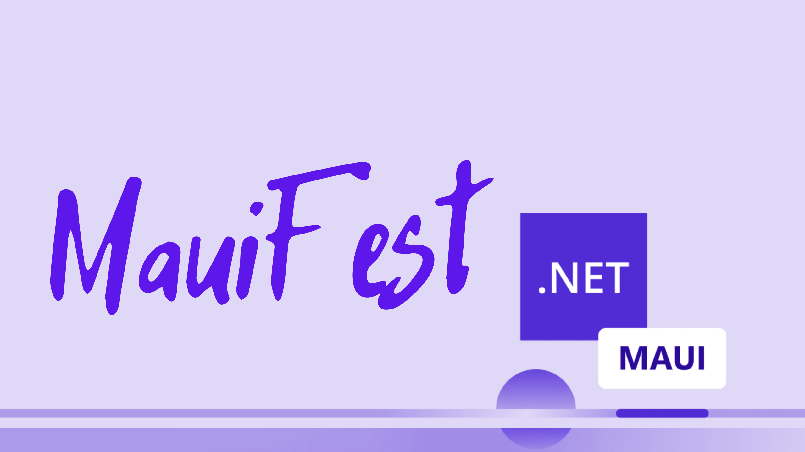

# MauiFest 2022

**MauiFest** 2022 es un evento de comunidad online y gratuito para celebrar el **lanzamiento de .NET MAUI**. Será un evento con varias sesiones técnicas relacionadas con el desarrollo de aplicaciones multiplataforma con .NET MAUI.

## [Entradas](https://www.eventbrite.es/e/entradas-mauifest-2022-312817945897)

A pesar de ser un evento gratuito, cuenta con **[entradas](https://www.eventbrite.es/e/entradas-mauifest-2022-312817945897)** para ayudar a llevar registro de asistentes y poder mantener una comunicación con los registrados enviando recordatorios o, tras el evento un enlace a todas las slides y material del evento que estará también en este mismo repositorio.

## [Call 4 Papers](https://sessionize.com/mauifest/)

¿Quieres participar con una sesión en el evento?. El **[Call 4 Paper](https://sessionize.com/mauifest/)** ya se encuentra abierto.